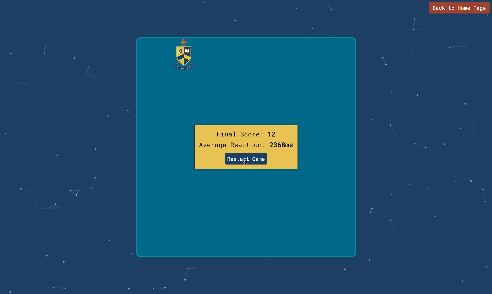

# ABHS Open Night Reaction Time Game
This is a simple yet engaging game I made for the open night aimed at P6 and P7 students looking to come to my school(Ashfield Boys' High School) to demostrate what could be created in the coding club that I run for younger pupils! 

##  [Play the Game](https://dylanmckenzie.github.io/ABHSOpenNightGame/)

## How to Play

1. Click the "Start Game" button
2. As soon as the target(the school logo) appears, click on it as fast as you can
3. You have 30 seconds to click as many as you can, good luck!

## Preview

